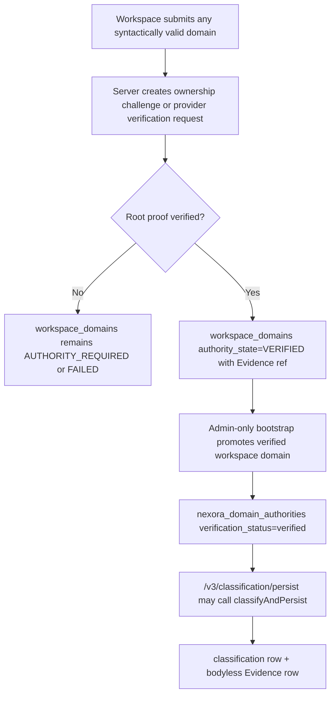
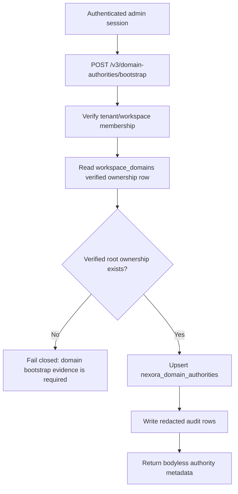

# NEXORA Domain Authority Bootstrap Design Report

Date: 2026-07-19

Mission: `NEXORA VERIFIED DOMAIN AUTHORITY BOOTSTRAP AND CLASSIFICATION ACTIVATION`

Verdict: `IMPLEMENTED_DEPLOYED_ACTIVATION_BLOCKED`

Project verdict remains: `LOGIC_COMPLETE_PARTIAL (MERGED + MIGRATED + DEPLOYED, ACCEPTANCE PENDING)`

Device verdict remains: `PARTIAL_REAL_DEVICE_PASS_SERVER_CORRELATION_PENDING`

## Domain Ownership Flow

## Authority Bootstrap Flow

## Validation Sources Inventory

- DNS TXT challenge: accepted root ownership source; implemented and deployed through migration `0078` plus authenticated production APIs.
- Cloudflare zone control: accepted root ownership source when provider API confirms account/zone control; `cloudmail_domains` currently has `0` rows.
- Google Workspace admin/domain metadata: accepted root ownership source when provider evidence binds tenant/domain; provider grant table currently has `0` rows.
- Microsoft tenant/admin verified-domain metadata: accepted root ownership source when provider evidence binds tenant/domain; provider grant table currently has `0` rows.
- `workspace_domains.authority_state=VERIFIED`: accepted bootstrap source; production currently has `0` verified rows.
- `mailbox_authorizations`: supplemental mailbox delegation only; production has `6` rows, but this is not domain-wide ownership.
- `workspace_account_bindings`: supplemental account/workspace evidence only.
- Cached `email` aggregates: supplemental only; cannot prove domain ownership and must not promote public domains.
- Admin declaration: never sufficient as root ownership evidence.
- iPhone/Desktop screenshots: viewport acceptance evidence only; never domain authority evidence.

## Authority Creation Path

Current deployed production now has a root-proof and bootstrap path staged from commit `02dd1ba6` on branch `codex/nexora-domain-authority-bootstrap`:

- `mail-worker/src/api/nexora-domain-authority-api.js`
- `mail-worker/src/service/nexora-domain-authority-bootstrap-service.mjs`
- `mail-worker/src/service/nexora-domain-ownership-service.mjs`
- `mail-worker/migrations/0078_nexora_domain_ownership_validation.sql`
- `mail-worker/scripts/domain-authority-bootstrap-contract-check.mjs`

Implemented behavior:

- Requires authenticated admin authority.
- Requires tenant/workspace binding through `workspace_members`.
- Rejects public mailbox domains before root-proof verification.
- Creates a DNS TXT challenge through `/v3/domain-ownership/dns-challenges`.
- Verifies the DNS TXT challenge through `/v3/domain-ownership/dns-challenges/verify`.
- Sets `workspace_domains.authority_state='VERIFIED'` only after DNS TXT proof is observed.
- Requires verified `workspace_domains` authority state.
- Treats CloudMail domain, account binding, and email aggregates as supplemental audit context only.
- Upserts `nexora_domain_authorities` idempotently by `(tenant_id, workspace_id, normalized_domain)`.
- Writes redacted `nexora_audit_events` and `workspace_audit_events`.
- Does not write `nexora_email_classifications`.
- Does not write `nexora_email_classification_evidence`.

## Classification Activation Path

Activation remains blocked until root domain ownership exists:

1. Domain ownership validation creates verified workspace-domain evidence.
2. Bootstrap creates verified `nexora_domain_authorities`.
3. Authenticated admin calls `/v3/classification/persist`.
4. `classifyAndPersist()` persists classification and bodyless Evidence rows.
5. Retrieval verifies generated data.

## Production Read-Only Evidence

Pre-migration commands were run read-only against remote D1 `cloud-mail`; all reported `changed_db=false`.

- `nexora_domain_authorities = 0`.
- Verified `workspace_domains = 0`.
- `workspace_domains = 0`.
- `cloudmail_domains = 0`.
- `workspace_provider_grants = 0`.
- `mailbox_authorizations = 6`.
- `nexora_email_classifications = 0`.
- `nexora_email_classification_evidence = 0`.

Post-deployment production evidence:

- Migration `0078_nexora_domain_ownership_validation.sql` applied successfully to remote D1 `cloud-mail`.
- Follow-up migration list returned `No migrations to apply`.
- Production Worker deployed successfully.
- Production Worker version ID: `efc31a3a-0f49-494b-800e-38cd80e6df47`.
- Production URL: `https://cloud-mail.fastonegroup.workers.dev`.
- Production root returned HTTP `200`.
- Unauthenticated `POST /api/v3/domain-ownership/dns-challenges` returned HTTP `200` with envelope code `401`.
- Unauthenticated `POST /api/v3/domain-ownership/dns-challenges/verify` returned HTTP `200` with envelope code `401`.
- Unauthenticated `POST /api/v3/domain-authorities/bootstrap` returned HTTP `200` with envelope code `401`.
- Unauthenticated `POST /api/v3/classification/persist` returned HTTP `200` with envelope code `401`.
- Post-deploy D1 counts: `nexora_domain_ownership_challenges=0`, verified `workspace_domains=0`, `nexora_domain_authorities=0`, `nexora_email_classifications=0`, `nexora_email_classification_evidence=0`.
- Post-deploy D1 verification reported `changed_db=false` for the count queries.

## Verification

- Repository guard passed for `/Users/billtin/Documents/cloudmail`.
- Apple Design Skill re-read; device viewport evidence remains visual acceptance evidence only.
- `npm run test:unit` passed in the clean production worktree.
- `npm run test:rc` passed: 13 files / 148 tests.
- New contract check passed: `domain authority bootstrap contract check passed`.
- `git diff --check` passed.
- No direct D1 business insert, Provider registration, secret operation, mailbox escalation, email aggregate authority proof, or persist-boundary bypass was performed.

## Acceptance Decision

Domain Authority Bootstrap implementation is deployed at the production boundary, but business activation is not complete.

Reason:

- Any legal domain can be modeled into a verification flow.
- Unverified domains cannot receive authority under the accepted model.
- DNS TXT root-proof flow and bootstrap endpoints are deployed.
- Production lacks an authenticated admin session in this execution context.
- Production lacks a completed DNS TXT root proof.
- Production lacks verified workspace-domain records and bootstrap execution.
- Classification runtime cannot activate until verified authority exists.

Final implementation verdict:

`IMPLEMENTED_DEPLOYED_ACTIVATION_BLOCKED`

Overall project verdict remains:

`LOGIC_COMPLETE_PARTIAL (MERGED + MIGRATED + DEPLOYED, ACCEPTANCE PENDING)`

## Activation Attempt - 2026-07-19T22:36Z

Mission: `NEXORA DOMAIN AUTHORITY ACTIVATION AND CLASSIFICATION PRODUCTION VALIDATION`

PR state:

- PR: `https://github.com/billyadult002/cloud-mail/pull/3`.
- State: `OPEN`.
- Mergeable: `MERGEABLE`.
- Head branch: `codex/nexora-domain-authority-bootstrap`.
- Head SHA: `06dbcd6681b8d086e939474e6835c4229e770b90`.

Runtime evidence:

- Production Worker remains reachable at `https://cloud-mail.fastonegroup.workers.dev`.
- Unauthenticated `POST /api/v3/domain-ownership/dns-challenges` returned HTTP `200` with envelope code `401`.
- Unauthenticated `POST /api/v3/domain-ownership/dns-challenges/verify` returned HTTP `200` with envelope code `401`.
- Unauthenticated `POST /api/v3/domain-authorities/bootstrap` returned HTTP `200` with envelope code `401`.
- Unauthenticated `POST /api/v3/classification/persist` returned HTTP `200` with envelope code `401`.

Production D1 evidence:

- `nexora_domain_ownership_challenges = 0`.
- Verified `workspace_domains = 0`.
- `nexora_domain_authorities = 0`.
- `nexora_email_classifications = 0`.
- `nexora_email_classification_evidence = 0`.
- Read-only D1 query metadata reported `changed_db=false`.

Checkpoint results:

- Checkpoint 1 Authenticated admin session: `BLOCKED_NO_ADMIN_SESSION_AVAILABLE`.
- Checkpoint 2 DNS TXT challenge created: `BLOCKED_AUTH_REQUIRED`.
- Checkpoint 3 DNS TXT challenge verified: `BLOCKED_NO_CHALLENGE_AND_NO_DNS_PROOF`.
- Checkpoint 4 `workspace_domains` becomes `VERIFIED`: `BLOCKED_NO_ROOT_PROOF`.
- Checkpoint 5 Bootstrap endpoint succeeds: `BLOCKED_NO_VERIFIED_WORKSPACE_DOMAIN`.
- Checkpoint 6 `nexora_domain_authorities > 0`: `FAIL_ZERO_ROWS`.
- Checkpoint 7 Approved real message selected: `BLOCKED_NO_AUTHENTICATED_JOURNEY`.
- Checkpoint 8 `classification/persist` executes: `BLOCKED_AUTH_AND_AUTHORITY_REQUIRED`.
- Checkpoint 9 `nexora_email_classifications > 0`: `FAIL_ZERO_ROWS`.
- Checkpoint 10 `nexora_email_classification_evidence > 0`: `FAIL_ZERO_ROWS`.
- Checkpoint 11 Retrieval verified: `BLOCKED_NO_ROWS_TO_RETRIEVE`.
- Checkpoint 12 Acceptance evidence package: `COMPLETE_FOR_BLOCKED_VERDICT`.

Boundary confirmation:

- No mailbox ownership was treated as domain ownership.
- No email aggregate was treated as authority proof.
- No public mailbox domain was bootstrapped.
- No business rows were inserted directly into D1.
- No bootstrap API, authentication boundary, or classification persist boundary was bypassed.
- No synthetic production evidence was generated.

Activation verdict:

`IMPLEMENTED_DEPLOYED_ACTIVATION_BLOCKED`

Overall project verdict remains:

`LOGIC_COMPLETE_PARTIAL (MERGED + MIGRATED + DEPLOYED, ACCEPTANCE PENDING)`
