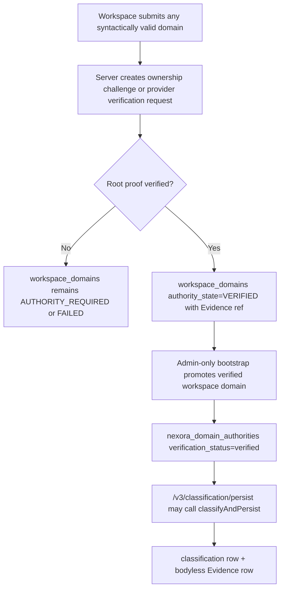
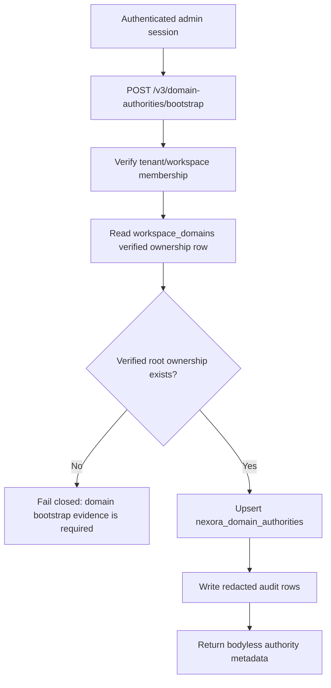

# NEXORA Domain Authority Bootstrap Design Report

Date: 2026-07-19

Mission: `NEXORA DOMAIN OWNERSHIP VALIDATION AND AUTHORITY BOOTSTRAP DESIGN`

Verdict: `DESIGN_READY_IMPLEMENTATION_PARTIAL`

Project verdict remains: `LOGIC_COMPLETE_PARTIAL (MERGED + MIGRATED + DEPLOYED, ACCEPTANCE PENDING)`

Device verdict remains: `PARTIAL_REAL_DEVICE_PASS_SERVER_CORRELATION_PENDING`

## Domain Ownership Flow

## Authority Bootstrap Flow

## Validation Sources Inventory

- DNS TXT challenge: accepted root ownership source; not currently implemented in production.
- Cloudflare zone control: accepted root ownership source when provider API confirms account/zone control; `cloudmail_domains` currently has `0` rows.
- Google Workspace admin/domain metadata: accepted root ownership source when provider evidence binds tenant/domain; provider grant table currently has `0` rows.
- Microsoft tenant/admin verified-domain metadata: accepted root ownership source when provider evidence binds tenant/domain; provider grant table currently has `0` rows.
- `workspace_domains.authority_state=VERIFIED`: accepted bootstrap source; production currently has `0` verified rows.
- `mailbox_authorizations`: supplemental mailbox delegation only; production has `6` rows, but this is not domain-wide ownership.
- `workspace_account_bindings`: supplemental account/workspace evidence only.
- Cached `email` aggregates: supplemental only; cannot prove domain ownership and must not promote public domains.
- Admin declaration: never sufficient as root ownership evidence.
- iPhone/Desktop screenshots: viewport acceptance evidence only; never domain authority evidence.

## Authority Creation Path

Current deployed production has no authority creation path. A local, un-deployed candidate path was staged on branch `codex/nexora-domain-authority-bootstrap`:

- `mail-worker/src/api/nexora-domain-authority-api.js`
- `mail-worker/src/service/nexora-domain-authority-bootstrap-service.mjs`
- `mail-worker/scripts/domain-authority-bootstrap-contract-check.mjs`

Candidate behavior:

- Requires authenticated admin authority.
- Requires tenant/workspace binding through `workspace_members`.
- Requires verified `workspace_domains` authority state.
- Treats CloudMail domain, account binding, and email aggregates as supplemental audit context only.
- Upserts `nexora_domain_authorities` idempotently by `(tenant_id, workspace_id, normalized_domain)`.
- Writes redacted `nexora_audit_events` and `workspace_audit_events`.
- Does not write `nexora_email_classifications`.
- Does not write `nexora_email_classification_evidence`.

## Classification Activation Path

Activation remains blocked until root domain ownership exists:

1. Domain ownership validation creates verified workspace-domain evidence.
2. Bootstrap creates verified `nexora_domain_authorities`.
3. Authenticated admin calls `/v3/classification/persist`.
4. `classifyAndPersist()` persists classification and bodyless Evidence rows.
5. Retrieval verifies generated data.

## Production Read-Only Evidence

Commands were run read-only against remote D1 `cloud-mail`; all reported `changed_db=false`.

- `nexora_domain_authorities = 0`.
- Verified `workspace_domains = 0`.
- `workspace_domains = 0`.
- `cloudmail_domains = 0`.
- `workspace_provider_grants = 0`.
- `mailbox_authorizations = 6`.
- `nexora_email_classifications = 0`.
- `nexora_email_classification_evidence = 0`.

## Verification

- Repository guard passed for `/Users/billtin/Documents/cloudmail`.
- Apple Design Skill re-read; device viewport evidence remains visual acceptance evidence only.
- `npm run test:unit` passed in the clean production worktree.
- New contract check passed: `domain authority bootstrap contract check passed`.
- `git diff --check` passed.
- No production writes, deployment, migration, direct D1 business insert, Provider registration, or secret operation was performed.

## Acceptance Decision

Domain Authority Bootstrap design is ready at the architecture boundary, but production acceptance is not complete.

Reason:

- Any legal domain can be modeled into a verification flow.
- Unverified domains cannot receive authority under the accepted model.
- A bootstrap endpoint candidate exists and is tested locally.
- Production lacks root ownership validation records, verified workspace-domain records, and deployed bootstrap execution.
- Classification runtime cannot activate until verified authority exists.

Final design verdict:

`DESIGN_READY_IMPLEMENTATION_PARTIAL`

Overall project verdict remains:

`LOGIC_COMPLETE_PARTIAL (MERGED + MIGRATED + DEPLOYED, ACCEPTANCE PENDING)`
