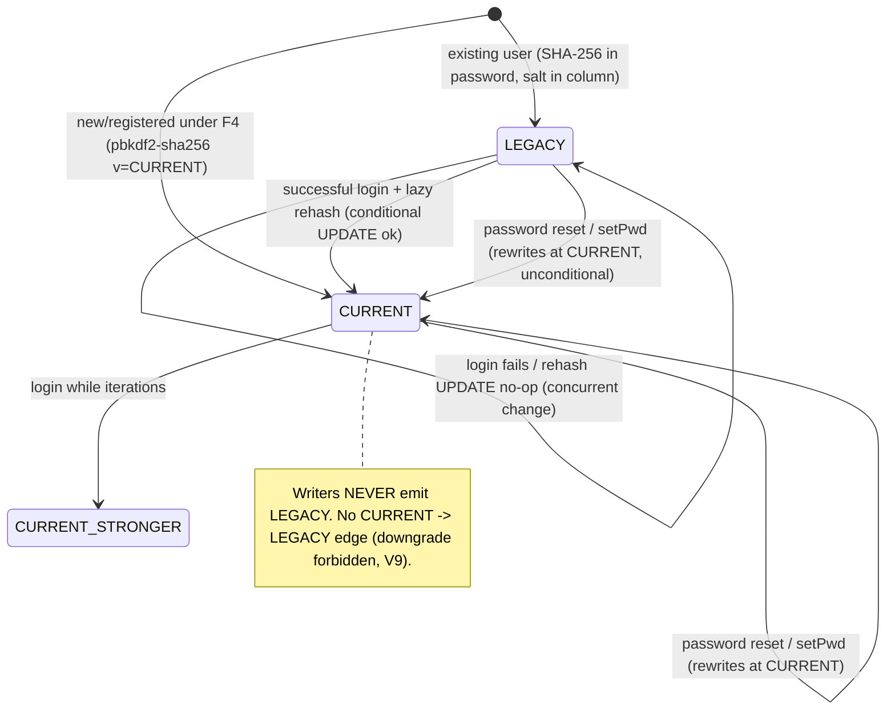

# Password KDF Migration State Machine (F4)

Mission: CLOUDMAIL PASSWORD KDF VERSIONED MIGRATION DESIGN. Date: 2026-07-16. Design-only.

## Per-user record lifecycle



## Login + lazy rehash sequence (verify callsites V1/V2/V3)

```
1. row = load user (password, salt)
2. { ok, needsRehash } = verify(input, row)      // format-aware, constant-time for new
3. if !ok: return auth failure (fail-closed on malformed/unknown, E12/A9)
4. auth SUCCEEDS (decision does not depend on needsRehash)
5. if needsRehash:                                // best-effort, non-blocking
     newRec = pbkdf2Encode(input, CURRENT_ITERATIONS)   // fresh salt
     UPDATE user SET password = :newRec, salt = ''      // conditional:
        WHERE user_id = :id AND password = :oldExact     // old value guard
     -- rows_affected 0 => a concurrent reset/rehash already changed it => skip, no error
6. return success
```

### Atomicity & failure semantics (ADR-5 / E10 / E11 / V7 / V8)

- **Upgrade is best-effort and never gates login (V7):** any error/timeout in step 5 is caught and
  ignored; the user is already authenticated. The next login retries the upgrade.
- **Conditional update (V8/V9):** `WHERE password = :oldExact` guarantees the rehash only replaces
  the exact record it verified. If a password reset (writes CURRENT unconditionally by `user_id`) or
  another login's rehash lands first, the guard fails → no-op. A reset therefore always wins and is
  never clobbered by a stale rehash.
- **No downgrade:** `pbkdf2Encode` only ever produces CURRENT-format; there is no path that writes a
  weaker record over a stronger one.

## New-password write paths (ADR-6 / A6 / V12)

All of W1–W5 (register, addUser, resetPassword/setPwd, provisioning) call the **same**
`pbkdf2Encode(password, CURRENT_ITERATIONS)` and store the self-describing record. After
implementation, **no path emits a legacy hash.** `genRandomPwd` still creates plaintext temp
passwords, which are then encoded via the new writer.

## Concurrency matrix (E11)

| Concurrent ops | Outcome |
|----------------|---------|
| login-rehash ∥ login-rehash (same user) | both derive CURRENT; first commit wins; second `WHERE oldExact` no-ops. Consistent. |
| login-rehash ∥ password reset | reset writes CURRENT by user_id; rehash `WHERE oldExact` no-ops (old value gone). Reset preserved (V8). |
| password reset ∥ password reset | last writer wins; both CURRENT; no legacy produced. |
| verify ∥ param bump (deploy) | records carry their own params; verify uses encoded params; new logins rehash to new target. |

## Fail-closed conditions (E12 / A9 / V10)

Malformed new record, unknown version/scheme, base64 decode failure, KDF error/timeout, or missing
salt for a legacy record ⇒ `verify` returns `ok=false` (deny) and emits a redacted audit event.
No silent fallback across formats; no plaintext ever logged.
