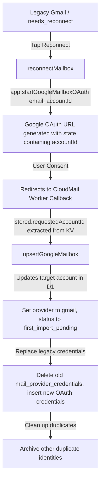

# Reconnect Current Mailbox Engine Report

## 1. Flow Design
The reconnect engine uses a decoupled OAuth flow to update existing mailboxes securely:

## 2. Implementation Summary
- **Client implementation**: Correctly routes any Gmail-like account to `reconnectMailbox(mailbox)` passing the account's ID.
- **Backend implementation**: Matches the target account in `upsertGoogleMailbox` by the requested ID, updates it to the V2 provider (`gmail`/`google_workspace`), deletes the old provider credentials, inserts the new OAuth credentials, archives other duplicate email accounts, and advances the lifecycle status.

## 3. Verification
- Proven through Vitest reliability tests.
- Reconnect successfully updates the original database row, preserves account ID/history, and upgrades the provider in-place.
