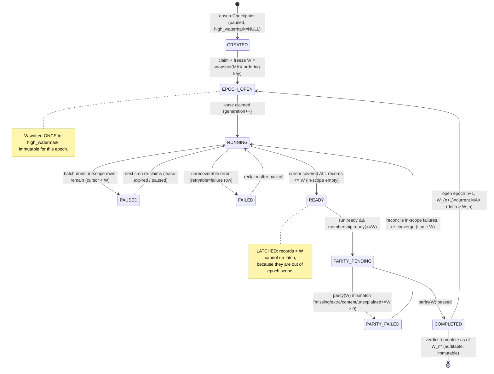

# UCS High-Watermark Completion State Machine

Mission: UCS HIGH-WATERMARK COMPLETION AND PARITY ENABLEMENT (design only)
Date: 2026-07-16

Per `(tenant_id, workspace_id, pipeline_key)` checkpoint. States map onto the existing
`conversation_materialization_checkpoints.state ∈ {running, ready, paused, failed}` plus a
logical `completed`/`epoch` overlay tracked via `high_watermark` + a completion marker.

## Diagram

## Transition table

| From | Event / guard | To | Side effects |
|------|----------------|----|--------------|
| CREATED | first claim | EPOCH_OPEN | freeze `high_watermark = W` (once) |
| EPOCH_OPEN | lease claim | RUNNING | `state='running'`, `lease_generation++`, lease=+60s then renew +5m/row |
| RUNNING | batch, cursor < W | PAUSED | commit cursor/processed; `lease_owner=NULL` |
| PAUSED | cron | RUNNING | reclaim expired/paused lease |
| RUNNING | in-scope exhausted (cursor ≥ W) | READY | `state='ready'` (latched; W unchanged) |
| RUNNING/READY | row error | FAILED / failure-row | `conversation_pipeline_failures` (retryable), scoped to ≤W |
| READY | `run.ready && membership.ready` | PARITY_PENDING | eligibility check (parity spec) |
| PARITY_PENDING | parity(W) mismatch ≤W | PARITY_FAILED→RUNNING | reconcile ≤W only |
| PARITY_PENDING | parity(W) passed | COMPLETED | write parity row `passed=1` at W; verdict recorded |
| COMPLETED | operator/auto epoch advance | EPOCH_OPEN(n+1) | new frozen `W_{n+1}`; delta backfill |

## Invariants

- **I1 (immutability):** once `high_watermark` is set for an epoch, no RUNNING/READY/PAUSED
  transition writes it. Only `CREATED→EPOCH_OPEN` and `COMPLETED→EPOCH_OPEN(n+1)` set W.
- **I2 (latching):** READY is a function of the immutable ≤W set only; arrivals > W cannot
  move READY back to RUNNING within the same epoch.
- **I3 (fencing):** all mutations remain gated by `lease_owner + lease_generation` (unchanged),
  so crash/reclaim is idempotent.
- **I4 (monotone verdicts):** epochs complete in order; `Completed(W_{n+1})` implies
  `Completed(W_n)` coverage remains valid (append-only).
