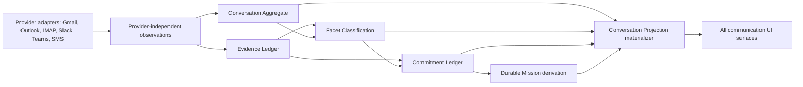

# NEXORA Unified Conversation System

Status: Foundation implemented locally; production cutover blocked on backfill, parity, mission provenance, client migration, and real-iPhone evidence.

## 1. Current-state assessment and gaps

Provider synchronization currently writes the `email` ledger and preserves Gmail readiness, checkpoints, recovery, and evidence. `/v2/mail/all` reads that ledger directly. Swift publishes `[EmailMessage]`, derives a singular category and work-queue heuristics locally, and creates some missions directly from messages. Migrations 0042/0043 add fenced classification runs, layer results, versioned conversation state, candidate commitments, and mission candidates, but `conversation_key` is still derived from account plus provider thread identity. There is no provider-independent aggregate, multi-category projection, separate Waiting For Me/Others ledger, projection watermark/parity system, or projection-only UI contract.

Consequently:

- provider thread identity still leaks into business identity;
- the latest classified message can dominate a nominal thread state;
- Category is singular and Risk/Domain are incomplete runtime facets;
- classification can suggest obligation state, while no independent product commitment ontology exists;
- mission candidates do not create evidence-bound durable missions;
- All Mail, Categories, queues, Workspace views, briefs, and Mission Center do not share one read model;
- a safe dual-write/backfill/shadow/cutover/rollback mechanism is absent.

## 2. Target architecture

Provider systems are observation sources. The aggregate ID, commitment lifecycle, mission identity, and projection are NEXORA business truth. Provider references are stored only as scoped bindings and hashed locators. Evidence Ledger remains authoritative for what was observed.

## 3. Conversation Aggregate

`conversation_aggregates` owns the stable internal UUID, Workspace scope, lifecycle, version, message/participant digests, integrity hash, and merge/split/tombstone state. It is never calculated from a provider thread identifier. `conversation_source_bindings` maps provider/account/thread locators to that UUID. `conversation_messages` records versioned observations; `conversation_participants` records hashed identity roles.

Identity rules:

1. Resolve an active source binding within tenant + Workspace + provider + account.
2. If absent, allocate a random internal conversation UUID and atomically create its first binding.
3. Correlation across accounts/providers requires explicit evidence and a governed merge; matching subject or participants alone is insufficient.
4. Merge/split produces history and replacement relationships; provider IDs never become the aggregate primary key.
5. Delegated mail preserves source owner/account and authorized subject separately.

Aggregate replay must be deterministic for the same ordered observation set. Duplicate and out-of-order observations are idempotent through provider locator plus source version. Tombstones are observations, not destructive deletes.

## 4. Facet Classification

`conversation_facet_results` is append-only and dimension/value based. Adding dimensions requires data, not schema changes. P0 declares Security, Identity, Origin, Intent, Relationship, Event, Actionability, Category, Overlay, Ranking, Risk, and Domain.

Each result contains classifier/version, input digest, confidence, status, explanation code, evidence IDs/set hash, observation/expiry time, and supersession. Multiple supported values in the same dimension are valid; a conversation may therefore be both Finance and Customer. Re-computation with changed input creates a new result version even when the classifier version is unchanged. Classification never mutates a commitment by itself.

Manual corrections are facet commands with explicit scope and evidence. Message-only remains the default. Sender/domain/workspace expansion requires separate authority and must not be inferred.

## 5. Commitment Ledger

`conversation_commitments` is the communication-obligation source of truth. Required states are:

- `WaitingForMe`: the Workspace actor owes the next verified action;
- `WaitingForOthers`: a verified external or delegated party owes the next action;
- `Resolved`: evidence proves completion or no remaining obligation;
- `Delegated`: ownership was explicitly transferred;
- `Scheduled`: a verified future execution time exists;
- `Blocked`: a named authority, policy, dependency, or safety blocker prevents progress;
- `Cancelled`: an authorized actor cancelled the obligation.

Every version binds conversation, business key, owner/beneficiary, obligation digest, evidence set, verification state, and optional delegation/schedule/blocker. `conversation_commitment_events` is append-only and idempotent. Transitions require expected version, allowed transition, actor authority, and evidence appropriate to the requested state. Classification may nominate a candidate but cannot transition the ledger.

0042/0043 commitments remain a compatibility input until safely mapped. Ambiguous legacy scope is quarantined read-only; it is never silently activated.

## 6. Conversation Projection

`conversation_projections` is an immutable-version materialized read model. One current row per conversation contains display fields, message/unread/attachment counts, multi-category keys, all facets, active commitment IDs/states, action/waiting flags, missions, ranking/risk, canonical folder, navigation references, search document, and integrity hash.

Named surfaces are predicates over this row only:

| Surface | Projection rule |
|---|---|
| All Mail | current and canonical folder is not Trash |
| Categories | requested key exists in `category_keys` |
| Action Required | `action_required = true` |
| Waiting For Me | `waiting_for_me = true` |
| Waiting For Others | `waiting_for_others = true` |
| Mission Control | one or more evidence-bound mission IDs |

Workspace views and AI Briefs consume the same DTO and projection summaries. Source navigation references may resolve message detail/action targets, but a list or briefing never reads provider storage directly.

## 7. Provider Capability Contract alignment

The authorization decision kernel remains unchanged. Each adapter additionally implements a provider-independent observation contract:

- provider/account locator and authorization generation;
- message and conversation locator hashes;
- stable source version, ordering time, direction, participants, tombstone state;
- delta cursor/checkpoint and page boundary;
- evidence references and integrity digest;
- capability/degradation status and retry classification;
- no business classification, commitment, mission, or projection decisions.

Gmail remains the first adapter. Outlook conversation IDs, Exchange/IMAP headers, Slack/Teams threads, and SMS groups map through the same binding interface.

## 8. Storage and migration sequence

Migration `0046_unified_conversation_system.sql` introduces aggregates, source bindings, messages, participants, facets, commitments/events, projections, materialization checkpoints, per-item failures, parity observations, and Workspace cutover state. It is additive and does not alter provider or 0042/0043 tables.

Deployment sequence:

1. Apply additive schema with all cutover flags false.
2. Deploy observation/projection code dark; Gmail sync remains authoritative for provider readiness.
3. Enable dual observation for one internal Workspace.
4. Run resumable historical backfill by Workspace/account/email cursor.
5. Rebuild facets and commitments from evidence; quarantine poison rows individually.
6. Materialize projections and compute legacy/projection parity per surface.
7. Enable shadow reads, then a single canary Workspace read flag.
8. Soak, verify, and expand by Workspace only.
9. Remove legacy UI paths only after every named surface passes static and device gates.

No destructive data migration is required. D1 rollback is forward-fix: disable projection reads while dual observation remains enabled.

## 9. APIs and service boundaries

`GET /v3/conversation-projections` is authenticated and Workspace-scoped. It accepts surface, category, query, cursor, and bounded size. Future commands are separate endpoints for facet correction, commitment transition, merge/split, and rebuild; reads never mutate state.

`unified-conversation-service.js` owns observation validation, aggregate resolution, message idempotency, pure projection derivation, named-surface predicates, and projection reads. Provider adapters do not call projection tables directly. Mission runtime does not accept a provider message as mission authority.

## 10. Ingestion, synchronization, and fault isolation

Existing Gmail page sync, readiness, checkpoint, evidence, and recovery behavior stays intact. After an email row is durably observed, a bounded UCS observation is enqueued/attempted. UCS failure must not roll back provider sync. Each message has an independent failure record, retry classification, attempt count, and next retry. Checkpoints advance over successfully handled or explicitly quarantined items, never hide a poison item, and never fail the page because of one row.

Aggregate, facet, commitment, and projection stages each have their own lease generation and watermark. Stale workers cannot publish current projections. Rebuilds derive from evidence and observations, not existing projection content.

## 11. Projection materialization

Materialization loads one aggregate version, supported non-expired facets, current verified commitments, and evidence-bound missions. It deterministically derives the DTO and integrity hash, supersedes the old current row, and inserts the next version atomically. Search is built from authorized bounded display text plus facet keys; secret/token fields are forbidden.

Projection lag, last high watermark, processed/quarantined counts, rebuild reason, and current materializer version are observable per Workspace. A projection can be fully deleted only by a forward migration/rebuild procedure; ordinary runtime rows are append-preserving.

## 12. Mission integration

Automatic mission creation requires a verified, nonterminal commitment version. The idempotency key binds Workspace, conversation, commitment ID/version, evidence set hash, projection version, policy version, and objective digest. The durable mission stores those references. Folder, category, provider label, or message location alone can never create a mission.

Manual user-created Goals remain a distinct mission origin (`manual_goal`) and must not be presented as commitment-derived. Inbox shortcuts become commitment proposals until verified.

## 13. Rollout and rollback

Cutover is per Workspace through `conversation_cutover_state`: dual write, shadow read, projection read, and cutover epoch are independent. Parity requires 100% backfill coverage, zero unexplained missing/duplicate conversations, stable replay hashes, representative row equality, bounded projection lag, and all six required surfaces passing.

Rollback flips only `projection_read_enabled` off, records a reason code, and returns clients to the compatibility endpoint while dual observation continues. Projection corruption triggers quarantine and evidence-based rebuild. Expired leases are reclaimed with incremented generation. Provider sync and checkpoints are never rolled back to projection state.

## 14. Telemetry, evidence, verification, and audit

Required metrics include observations accepted/duplicate/quarantined, aggregate creations/merges/splits, facet abstention/conflict/expiry, commitment transitions/rejections, projection latency/lag/rebuilds, parity missing/extra/count mismatch, mission provenance rejection, stale-fence rejection, and per-provider sync regressions.

Audit records contain safe IDs, hashes, versions, reason codes, and evidence references—never credentials or message bodies. Verification covers tenant isolation, delegated authority, deterministic replay, idempotency, out-of-order observations, poison-message isolation, multi-category facets, commitment transition matrix, mission provenance, projection parity, recovery, and privacy redaction.

## 15. Comprehensive dependency-ordered task list

- [x] Current-state backend and UI read-path audit.
- [x] Additive 0046 foundation schema and structural dry-run.
- [x] Provider-independent aggregate allocation/binding and message observation contract.
- [x] Extensible facets, required commitment vocabulary, projection derivation, and projection API foundation.
- [x] Focused tests and full Worker regression (199 tests at foundation checkpoint).
- [ ] Add governed merge/split/tombstone service and deterministic aggregate fold/replay tests.
- [ ] Add Gmail post-commit observation hook plus independent per-message retry/outbox.
- [ ] Bridge 0042/0043 facets/commitments with explicit supersession and quarantine rules.
- [ ] Implement materializer transaction, lease fencing, current-version supersession, and evidence-based rebuild.
- [ ] Implement resumable Workspace/account backfill and parity evaluator for all six surfaces.
- [ ] Bind durable mission creation to verified UCS commitment/projection provenance.
- [ ] Add Swift `ConversationProjection` DTO/store and dual-read telemetry.
- [ ] Cut Inbox/MailVisibilityEngine, categories, queues, Workspace views, briefs, and Mission Control to projection DTOs.
- [ ] Add exact Waiting For Me and Waiting For Others surfaces.
- [ ] Add static architecture gate rejecting direct provider/email reads in target surfaces.
- [ ] Run migration against a production-shape local copy, reliability/isolation/replay tests, and Gmail regressions.
- [ ] Apply 0046 remotely only after review; deploy dark and verify schema/version.
- [ ] Canary dual observation/backfill/shadow parity with no read cutover.
- [ ] Enable per-Workspace projection reads after parity; perform real-iPhone acceptance on the production bundle.

## 16. Production-readiness verdict

`PARTIAL / IN_PROGRESS`. The architecture, additive schema, provider-independent service boundary, projection API foundation, and initial verification are implemented locally. Production deployment and user-visible cutover are not ready because observation dual-write, backfill, materializer fencing, parity, mission provenance, Swift projection consumption, and physical-iPhone acceptance remain open. Applying 0046 is reversible at the read boundary, but enabling projection reads before those gates would create a material data-visibility risk and is forbidden.

Next execution phase: implement the Gmail-safe post-commit observation/outbox, fenced materializer, resumable backfill, and parity evaluator while all cutover flags remain false.
